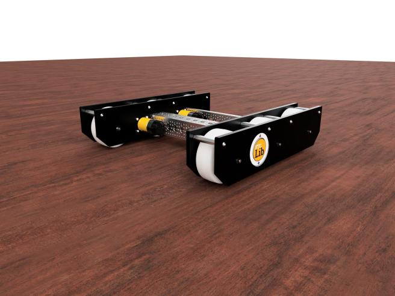
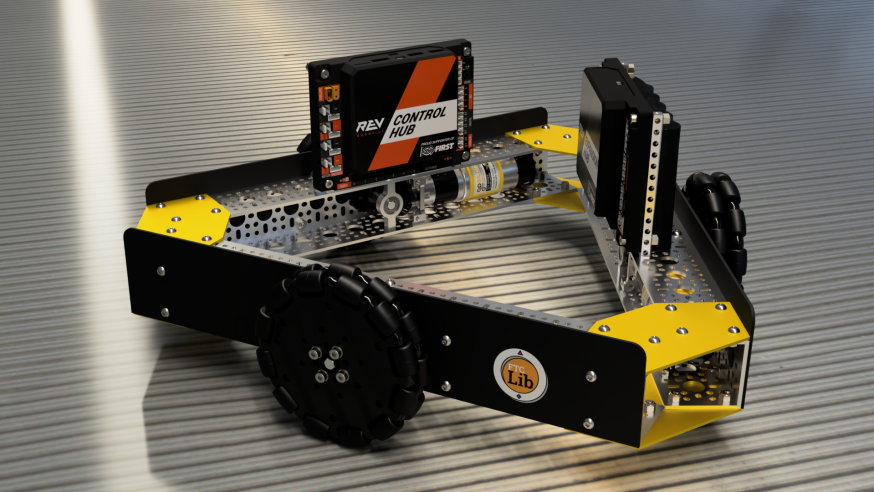
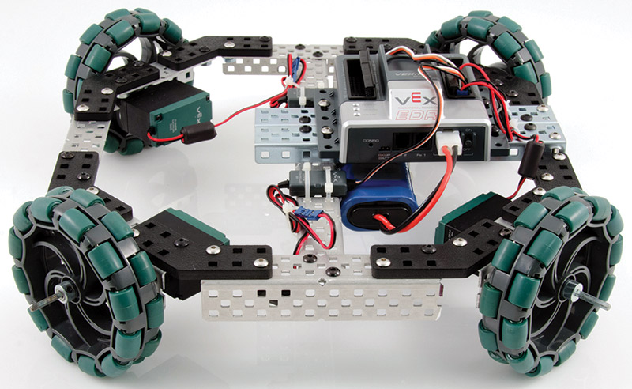
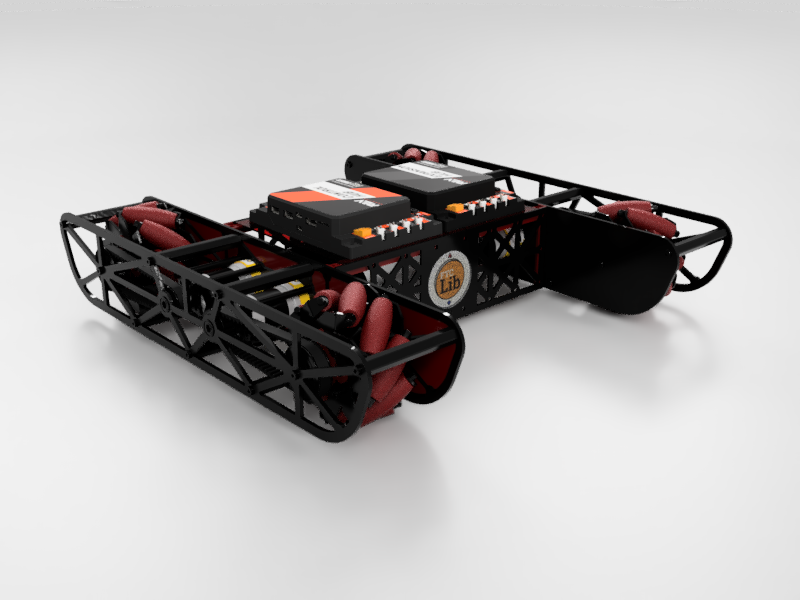

# Drivebases

All of the [FTCLib drivebase classes](https://github.com/FTCLib/FTCLib/tree/dev/core/src/main/java/com/arcrobotics/ftclib/drivebase) are based on the `RobotBase` abstract class. This is functionally similar to the [RobotDriveBase ](https://github.com/wpilibsuite/allwpilib/blob/50db653f8d864c594c6a9ab7dd5a0f45b4483a03/wpilibj/src/main/java/edu/wpi/first/wpilibj/drive/RobotDriveBase.java)class in WPILib. It contains:

* An enumerator for the different motor types \(i.e. the indices of the motors in the array\)
* Maximum possible speed for the drivebase to approach
* A clipping method between a minimum and maximum value
* Normalization of wheel speeds
* A `stop()` method
* Square input method

All of the following drive types are available for use in FTCLib. All that's needed for the user to do is plug in the values to an instantiation of the object.

## Differential

A differential drive is one that has two motors or motor groups on either side of the robot. Each side acts as a connected set or motor group. There are two types of drive systems here. You can use the tank and arcade control schemes with a differential drive.



Creating the drivetrain object is simple:

```java
DifferentialDrive m_drive = new DifferentialDrive(m_left, m_right);
```

The constructor has two parameters: left and right. For a differential drive, it considers each side as a single motor. As a result, you need to pass in a motor group object.

### Arcade

Arcade drive use a y-value input from the controller and a value from the turn stick. We know that when the turn stick is pushed left, the right side should move forward and the left side should move backwards. Therefore, since pushing the turn stick to the left returns a negative value, it should be added to the left speed and subtracted from the right speed.

Here is how to call the method for arcade drive. An additional boolean parameter is optional, which is `squareInputs`. By default, this value is false.

```java
m_drive.arcadeDrive(forwardSpeed, turnSpeed);
```

### Tank

Tank drive uses a y-value input from the left and right sticks. The sticks control their respective side of the robot.

```java
m_drive.tankDrive(leftSpeed, rightSpeed);
```

## Holonomic

In FTCLib, we shortened holonomic drive to the generic term H-Drive. A holonomic drive is one that can move in omnidirectional space, which is why it is often called an omnidirectional drive. There are different sub-types of holonomic drivebases.

### Holonomic Drivebases

#### Three Wheel Holonomic

A three wheel holonomic drivebase, otherwise known as a "Kiwi" or "Killough," is a drivetrain with omnidirectional motion while utilizing three omniwheels.



You can create the kiwi drive as such:

```java
// for if the wheels are oriented at 60 degrees,
// 120 degrees, and 270 degrees
HDrive kiwi_A = new HDrive(left, right, slide);

// for if the wheels are oriented at other angles
HDrive kiwi_B = new HDrive(left, right, slide,
                           leftAngle, rightAngle, slideAngle);
```

Your slide motor is generally the back of the kiwi drive and the others are self-explanatory.

#### X-Drive

An X-drive is a holonomic base that has four omniwheels positioned into an "X" shape as seen below.



You can create the x-drive drive as such:

```java
// input motors exactly as shown below
HDrive xDrive = new HDrive(frontLeft, frontRight,
                           backLeft, backRight);
```

#### Mecanum

A mecanum drivebase is a type of holonomic drive that utilizes [mecanum wheels](https://en.wikipedia.org/wiki/Mecanum_wheel) for movement.



For more information on mecanum drives, please watch this video:



You can create the mecanum drive as such:

```java
// input motors exactly as shown below
MecanumDrive mecanum = new MecanumDrive(frontLeft, frontRight,
                                        backLeft, backRight);
```

### Control Scheme

Like how the differential drive has two different control schemes, so too does holonomic. There is field-centric and robot-centric. The only difference is that there is some sort of interpolation of the robot's heading \(the direction the forward face is pointing globally\).

#### Robot-Centric

Robot-centric assumes that each push of the joystick is in relation to the local position of the robot—this means that whenever the user pushes the drive stick forward, the robot will drive in the direction of its front-facing side.

For all types of holonomic drive you do this by calling the .`driveRobotCentric()` method that takes the gamepad inputs and converts them into directional values.

```java
m_drive.driveRobotCentric(strafeSpeed, forwardSpeed, turnSpeed)
```

#### Field-Centric

Field-centric assumes that each push of the joystick is in relation to the global position of the robot—this means that whenever the user pushes the drive stick forward, the robot will move away from the driver no matter its orientation. This is done by rotating the direction of the joystick clockwise by an angle measurement equivalent to the global heading of the robot.

For all types of holonomic drive you do this by calling the .`driveFieldCentric()` method that takes the gamepad inputs and converts them into directional values. Additionally, you include the reading for the heading in degrees.

```java
m_drive.driveFieldCentric(strafeSpeed, forwardSpeed, turn, heading);
```

### Sample


```java
@TeleOp
public class BasicDriveOpMode extends OpMode {

    private Motor fL, fR, bL, bR;
    private MecanumDrive drive;
    private GamepadEx driverOp;

    @Override
    public void init() {
        /* instantiate motors */
        
        drive = new MecanumDrive(fL, fR, bL, bR);
        driverOp = new GamepadEx(gamepad1);
    }
    
    @Override
    public void loop() {
        drive.driveRobotCentric(
            driverOp.getLeftX(),
            driverOp.getLeftY(),
            driverOp.getRightY()
        );
    }

}
```


