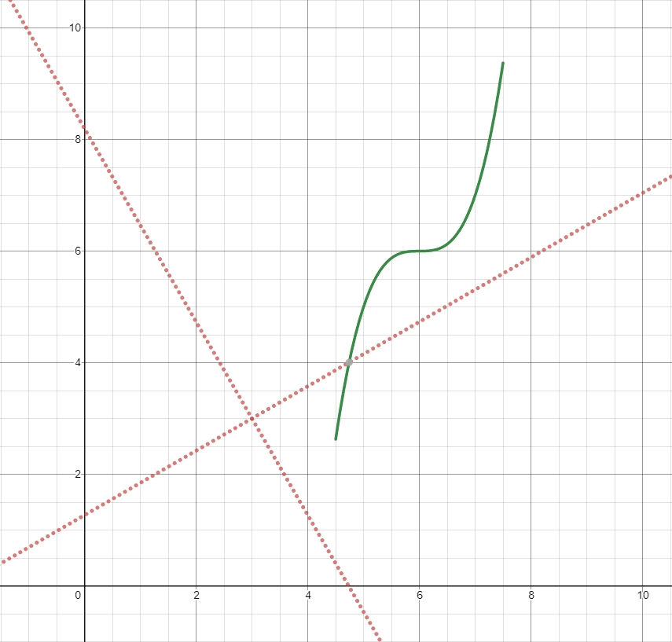
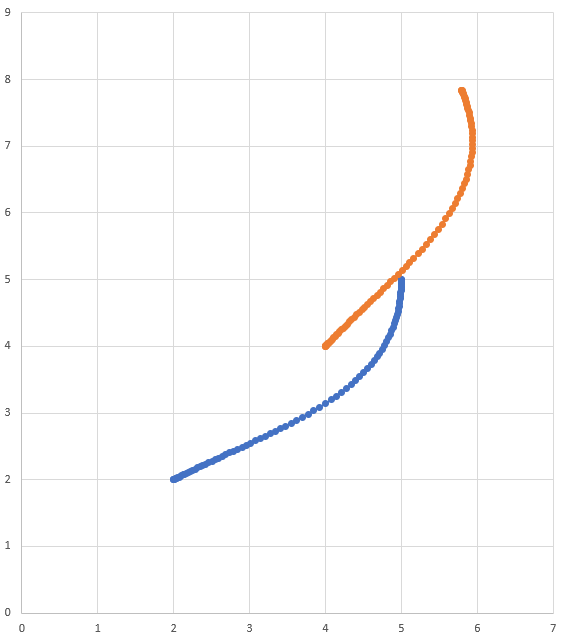

# Transforming Trajectories

Trajectories can be transformed from one coordinate system to another and moved within a coordinate system using the `relativeTo` and the `transformBy` methods. These methods are useful for moving trajectories within space, or redefining an already existing trajectory in another frame of reference.

#### Note

Neither of these methods changes the shape of the original trajectory.

## The `relativeTo` Method

The `relativeTo` method is used to redefine an already existing trajectory in another frame of reference. This method takes one argument: a pose, \(via a `Pose2d` object\) that is defined with respect to the current coordinate system, that represents the origin of the new coordinate system.

For example, a trajectory defined in coordinate system A can be redefined in coordinate system B, whose origin is at \(2, 2, 30 degrees\) in coordinate system A, using the `relativeTo` method.

```java
Pose2d bOrigin = new Pose2d(2, 2, Rotation2d.fromDegrees(30));
Trajectory bTrajectory = aTrajectory.relativeTo(bOrigin);
```



In the diagram above, the original trajectory \(`aTrajectory` in the code above\) has been defined in coordinate system A, represented by the black axes. The red axes, located at \(2, 2\) and 30° with respect to the original coordinate system, represent coordinate system B. Calling `relativeTo` on `aTrajectory` will redefine all poses in the trajectory to be relative to coordinate system B \(red axes\).

## The `transformBy` Method

The `transformBy` method can be used to move \(i.e. translate and rotate\) a trajectory within a coordinate system. This method takes one argument: a transform \(via a `Transform2d` object\) that maps the current initial position of the trajectory to a desired initial position of the same trajectory.

For example, one may want to transform a trajectory that begins at \(2, 2, 30 degrees\) to make it begin at \(4, 4, 50 degrees\) using the `transformBy` method.

```java
Transform2d transform = new Pose2d(4, 4, Rotation2d.fromDegrees(50)).minus(trajectory.getInitialPose());
Trajectory newTrajectory = trajectory.transformBy(transform);
```



In the diagram above, the original trajectory, which starts at \(2, 2\) and at 30° is visible in blue. After applying the transform above, the resultant trajectory’s starting location is changed to \(4, 4\) at 50°. The resultant trajectory is visible in orange.

